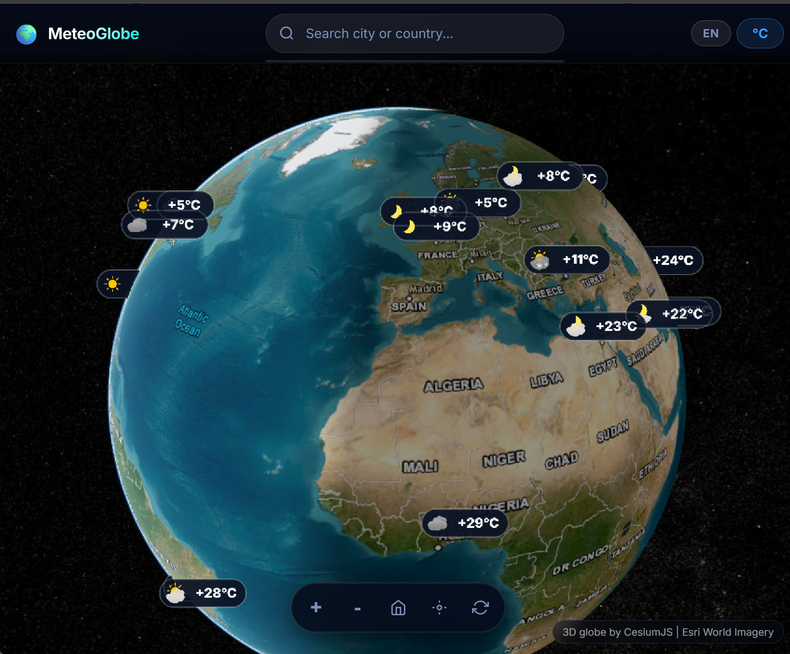
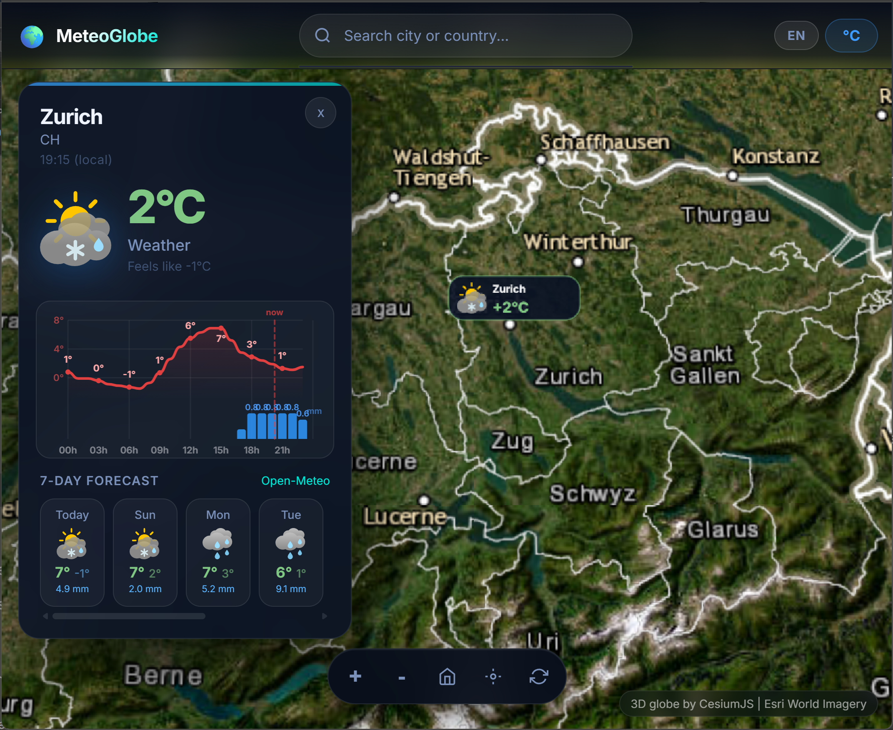

# MeteoGlobe

Interactive 3D weather globe powered by Open-Meteo (free, no API key needed).

Live demo: https://meteoglobe.piweb.ch/





## Install

### 1. Install Docker (Raspberry Pi / Debian)

```bash
# Install prerequisites
sudo apt-get update
sudo apt-get install -y ca-certificates curl

# Add Docker's official GPG key
sudo install -m 0755 -d /etc/apt/keyrings
sudo curl -fsSL https://download.docker.com/linux/debian/gpg -o /etc/apt/keyrings/docker.asc
sudo chmod a+r /etc/apt/keyrings/docker.asc

# Add the Docker repository
echo \
  "deb [arch=$(dpkg --print-architecture) signed-by=/etc/apt/keyrings/docker.asc] https://download.docker.com/linux/debian \
  $(. /etc/os-release && echo "$VERSION_CODENAME") stable" | \
  sudo tee /etc/apt/sources.list.d/docker.list > /dev/null

# Install Docker Engine
sudo apt-get update
sudo apt-get install -y docker-ce docker-ce-cli containerd.io docker-buildx-plugin docker-compose-plugin

# Allow your user to run Docker without sudo
sudo usermod -aG docker $USER
```

Log out and back in (or run `newgrp docker`) for the group change to take effect.

Verify it works:

```bash
docker --version
docker compose version
```

### 2. Clone the repository

```bash
git clone https://github.com/PiWebswiss/meteo-globe.git
cd meteo-globe
```

### 3. Start MeteoGlobe

```bash
docker compose up -d --build
```

Open http://localhost:3000 in your browser.

## Project layout

- `server.py`: FastAPI backend (weather proxy, icon serving, satellite tile caching)
- `public/app.js`: globe UI, markers, weather panel
- `public/icons/`: MeteoSwiss SVG weather icons
- `docker-compose.yml`: app container config

## Expose via Cloudflare Tunnel (optional)

To make MeteoGlobe accessible over the internet without port forwarding, use a Cloudflare Tunnel:

Guide: https://developers.cloudflare.com/cloudflare-one/networks/connectors/cloudflare-tunnel/get-started/

## Troubleshooting

- Icons missing: make sure `public/icons/` exists in the container with SVG files.
- Port conflict: change `3000:3000` to a free port in `docker-compose.yml`.
- Blank globe: hard refresh (`Ctrl+F5`) to clear cached assets.
